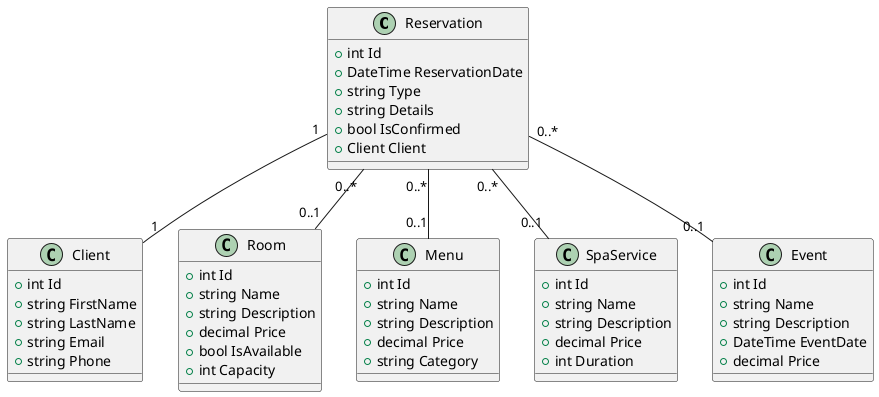

## Diagramme UML (PlantUML)

-------------------------------
  PrgFinalSujet3
 Description
PrgFinalSujet3 est une application web ASP.NET Core MVC permettant la gestion complète d’un établissement hôtelier avec services de restauration, spa et organisation d’événements.Elle propose la réservation en ligne, la gestion des chambres, des menus, des services bien-être, des événements et un espace d’administration.
  Fonctionnalités principales
•	Gestion des réservations (hôtel, restaurant, spa, événements)
•	Gestion des chambres (types, prix, disponibilité)
•	Gestion des menus (plats, catégories, prix)
•	Gestion des services de spa (types, durée, prix)
•	Gestion des événements (création, réservation, tarification)
•	Paiement en ligne (PayPal, carte bancaire)
•	Administration (validation, suppression, suivi des réservations)
  Technologies utilisées
•	.NET 8.0 / ASP.NET Core MVC
•	Entity Framework Core (SQL Server)
•	Bootstrap 5
•	PayPal SDK (paiement en ligne)
  Structure du projet
•	Controllers/ : Contrôleurs MVC (logique métier)
•	Models/ : Modèles de données (chambres, menus, spa, événements, réservations)
•	Service/ : Services métiers (gestion des entités)
•	Views/ : Vues Razor (pages HTML)
•	Migrations/ : Migrations Entity Framework
•	wwwroot/ : Fichiers statiques (CSS, JS, images)
 Structure de la Base de Données
•	Les modèles principaux incluent :
•	- `Room` (Chambres)
•	- `Menu` (Carte du restaurant)
•	- `SpaService` (Services de bien-être)
•	- `Event` (Événements)
•	- `Reservation` (Réservations)
•	- `client` (Clients)
 Exemples d’utilisation
•	Réserver une chambre, un menu, un soin spa ou une place à un événement
•	Gérer les réservations depuis l’espace d’administration
•	Payer en ligne via PayPal ou carte bancaire

  Points Forts
     	**Architecture Modulaire**
	   - Séparation claire des responsabilités
	   - Utilisation d'interfaces pour les services
	   - Injection de dépendances

  Auteurs
Dans le cadre du module de programmation .NET, ce projet est réalisé par :
•	El Qasri Othman
•	Bellal Mouna
•	Baderra Taha
